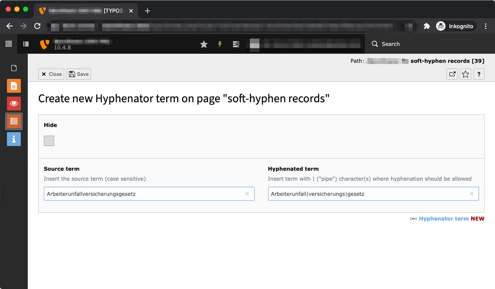

TYPO3 Hyphenator
======================================

This extension allows you to add soft-hyphen definitions to your TYPO3.  
Those rules will be applied to the frontend at the end of your middleware stack.

This extension aims to give you full control about HOW you want specific terms 
to break in case of having limited space. There are other client- & server-side 
solutions out there which do all the magic w/o you having to provide specifications, 
but they may result in endlessly huge pain on designer and customer sites. 

So as a simple example, this extension allows you to NOT have break like this:  

> ... ... .. ..... ... Ar-   
> beiterunfallversicherungsgesetz

> ... ... .. ..... Arbeiterun-  
> fallversicherungsgesetz

> Arbeiterun-       
> fallver-  
> sicherungsge-  
> setz

You can have this:

> ... ... .. ..... ... Arbeiter-  
> unfallversicherungsgesetz

> ... ... .. ..... Arbeiterunfall-  
> versicherungsgesetz

> Arbeiter-  
> unfall-  
> versicherungs-  
> gesetz

**YAY!**

## How to install

```
composer require straschek-io/typo3-hyphenator  
vendor/bin/typo3 extension:activate typo3_hyphenator
```

No further configuration needed.

## How to use



1. Just add a "Hyphenator term" record and clear the TYPO3 cache
2. Reload your frontend

The `pid` field is not evaluated, so simply drop the records into a
sys folder to your liking. 

## Good to know

I tried several PHP based DOM parsers, but they all significantly suffered from complexity
and performance issues.  

The replacement now is implemented in a super simple way via `preg_replace()`. This may 
and will not cover all cases. Maybe I failed on it, but this approach IMHO works best:   
simple & fast.

If you have improvement suggestions, [find the used regular expression on regex101.com](https://regex101.com/r/TqEXaV/1).   
I am open to enhance this.

## Compatibility

Compatible with TYPO3 10.4+   
Tested manually. No automated tests planned (so far).

Works for me, may work for you.
