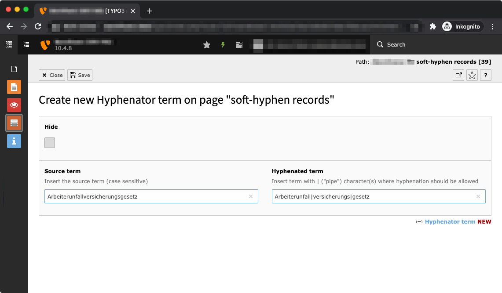

TYPO3 Hyphenator
======================================

This extension allows you to add soft-hyphen definitions to your TYPO3.  
Those rules will be applied to the frontend at the end of your middleware stack.

This extension aims to give you full control about HOW you want specific terms 
to break in case of having limited space. There are other client- & server-side 
solutions out there which do all the magic w/o you having to provide specifications, 
but they may result in endlessly huge pain on designer and customer sites. 

So as a simple example, this extension allows you to NOT have break like this:  

> ... ... .. ..... ... Ar-   
> beiterunfallversicherungsgesetz

> ... ... .. ..... Arbeiterun-  
> fallversicherungsgesetz

> Arbeiterun-       
> fallver-  
> sicherungsge-  
> setz

You can have this:

> ... ... .. ..... ... Arbeiter-  
> unfallversicherungsgesetz

> ... ... .. ..... Arbeiterunfall-  
> versicherungsgesetz

> Arbeiter-  
> unfall-  
> versicherungs-  
> gesetz

**YAY!**

## How to install

```
composer require straschek-io/typo3-hyphenator  
vendor/bin/typo3 extension:activate typo3_hyphenator
```

No further configuration needed.

## How to use



1. Just add a "Hyphenator term" record and clear the TYPO3 cache
2. Reload your frontend

The `pid` field is not evaluated, so simply drop the records into a
sys folder to your liking. 

## Good to know

- Replacement happens in a PSR-15 middleware and only touches `text/html` responses.
  JSON, XML sitemaps and other content types pass through untouched.
- The parser works in a single `preg_replace_callback()` pass over the rendered HTML.
  Tags and their attributes, `<head>`, `<script>`, `<style>`, `<textarea>` and HTML
  comments are never touched.
- Terms are matched literally (no regular expressions in the "from" field) and must
  start at a word boundary.
- Prefix matching is intended behavior: a term like `Arbeit` also hyphenates the
  beginning of `Arbeitsamt`. If several terms match, the longest one wins.
- DOM-based parsing (libxml `DOMDocument`, `Masterminds\HTML5`) was evaluated and
  benchmarked, but both were orders of magnitude slower than the single regex pass:
  simple & fast still wins.

## Compatibility

Compatible with TYPO3 12.4 and 13.4   
Tested manually. No automated tests planned (so far).

Works for me, may work for you.
